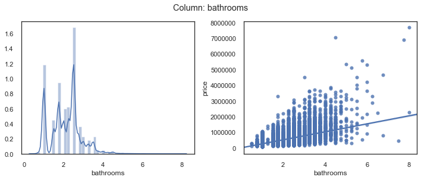

# TABLE OF CONTENTS
### [OVERVIEW OF OSEMiNl](#OVERVIEW-OF-OSEMiN)
- [OBTAIN](#OBTAIN) 
- [SCRUB](#SCRUB) 
- [EXPLORE](#EXPLORE) 
- [MODEL](#MODEL) 
- [iNTERPRET](#iNTERPRET) 

### [CONCLUSIONS & RECOMMENDATIONS](#CONCLUSIONS-&-RECOMMENDATIONS)
___

# PROCESS CHECKLIST

1. **OBTAIN:**
    - Import data, inspect, check for datatypes to convert and null values
    - Display header and info.
    - Drop any unneeded columns, if known (`df.drop(['col1','col2'],axis=1,inplace=True`)
    <br><br>

2. **SCRUB: cast data types, identify outliers, check for multicollinearity, normalize data**
    - Check and cast data types
        - [ ] Check for #'s that are store as objects (`df.info()`,`df.describe()`)
            - when converting to #'s, look for odd values (like many 0's), or strings that can't be converted.
            - Decide how to deal weird/null values (`df.unique()`, `df.isna().sum()`)
            - `df.fillna(subset=['col_with_nulls'],'fill_value')`, `df.replace()`
        - [ ]  Check for categorical variables stored as integers.
            - May be easier to tell when you make a scatter plotm or `pd.plotting.scatter_matrix()`
    - [ ] Check for missing values  (df.isna().sum())
        - Can drop rows or colums
        - For missing numeric data with median or bin/convert to categorical
        - For missing categorical data: make NaN own category OR replace with most common category
    - [ ] Check for multicollinearity
        - Use seaborn to make correlation matrix plot 
        - Good rule of thumb is anything over 0.75 corr is high, remove the variable that has the most correl with the largest # of variables
    - [ ] Normalize data (may want to do after some exploring)
        - Most popular is Z-scoring (but won't fix skew) 
        - Can log-transform to fix skewed data
    
            
3. **EXPLORE:Check distributions, outliers, etc**
    - [ ] Check scales, ranges (df.describe())
    - [ ] Check histograms to get an idea of distributions (df.hist()) and data transformations to perform.
        - Can also do kernel density estimates
    - [ ] Use scatter plots to check for linearity and possible categorical variables (`df.plot("x","y")`)
        - categoricals will look like vertical lines
    - [ ] Use `pd.plotting.scatter_matrix(df)` to visualize possible relationships
    - [ ] Check for linearity.
   
4. **FIT AN INITIAL MODEL:** 
    - Various forms, detail later...
    - **Assessing the model:**
        - Assess parameters (slope,intercept)
        - Check if the model explains the variation in the data (RMSE, F, R_square)
        - *Are the coeffs, slopes, intercepts in appropriate units?*
        - *Whats the impact of collinearity? Can we ignore?*
        <br><br>
5. **Revise the fitted model**
    - Multicollinearity is big issue for lin regression and cannot fully remove it
    - Use the predictive ability of model to test it (like R2 and RMSE)
    - Check for missed non-linearity
6. **Holdout validation / Train/test split**
    - use sklearn train_test_split 
___

## Mod One Project Submission

Please fill out:
* Student name: John Lemaster
* Student pace: Online full time
* Scheduled project review date/time: 
* Instructor name: Rafael Carrasco & James Irving
* Blog post URL:

# OBTAIN

## Business Requirements
Lemaster Consulting has been engaged by Flips Inc. to research King County housing market to help them make better investment decisions on which properties to buy, rehab and resell for a profit.  Lemaster Consulting will do data research to recommend what which types of properties and more importantly which features have the most potential to increase profit margins.


```python
%ls
```

    CONTRIBUTING.md               kc_house_data.csv
    LICENSE.md                    mod1_project_JMI-Copy1.ipynb
    OSEMIN_scaffolding.ipynb      mod1_project_JMI.ipynb
    README.md                     module1_project_rubric.pdf
    Untitled.ipynb                student.ipynb
    awesome.gif                   study_group_starter.ipynb
    column_names.md               untitled


```python
import pandas as pd
import matplotlib.pyplot as plt
import matplotlib as mpl
import seaborn as sns
import numpy as np
%matplotlib inline
inline_rc = dict(mpl.rcParams)

plt.style.use('seaborn')

import statsmodels.api as sm
import statsmodels.formula.api as smf
from scipy.stats import normaltest as normtest # D'Agostino and Pearson's omnibus test

from collections import Counter
from sklearn.preprocessing import RobustScaler
from sklearn.preprocessing import MinMaxScaler
```


```python
df = pd.read_csv('kc_house_data.csv')
df.head()
```


<div>
<style scoped>
    .dataframe tbody tr th:only-of-type {
        vertical-align: middle;
    }

    .dataframe tbody tr th {
        vertical-align: top;
    }

    .dataframe thead th {
        text-align: right;
    }
</style>
<table border="1" class="dataframe">
  <thead>
    <tr style="text-align: right;">
      <th></th>
      <th>id</th>
      <th>date</th>
      <th>price</th>
      <th>bedrooms</th>
      <th>bathrooms</th>
      <th>sqft_living</th>
      <th>sqft_lot</th>
      <th>floors</th>
      <th>waterfront</th>
      <th>view</th>
      <th>condition</th>
      <th>grade</th>
      <th>sqft_above</th>
      <th>sqft_basement</th>
      <th>yr_built</th>
      <th>yr_renovated</th>
      <th>zipcode</th>
      <th>lat</th>
      <th>long</th>
      <th>sqft_living15</th>
      <th>sqft_lot15</th>
    </tr>
  </thead>
  <tbody>
    <tr>
      <th>0</th>
      <td>7129300520</td>
      <td>10/13/2014</td>
      <td>221900.0</td>
      <td>3</td>
      <td>1.00</td>
      <td>1180</td>
      <td>5650</td>
      <td>1.0</td>
      <td>NaN</td>
      <td>0.0</td>
      <td>3</td>
      <td>7</td>
      <td>1180</td>
      <td>0.0</td>
      <td>1955</td>
      <td>0.0</td>
      <td>98178</td>
      <td>47.5112</td>
      <td>-122.257</td>
      <td>1340</td>
      <td>5650</td>
    </tr>
    <tr>
      <th>1</th>
      <td>6414100192</td>
      <td>12/9/2014</td>
      <td>538000.0</td>
      <td>3</td>
      <td>2.25</td>
      <td>2570</td>
      <td>7242</td>
      <td>2.0</td>
      <td>0.0</td>
      <td>0.0</td>
      <td>3</td>
      <td>7</td>
      <td>2170</td>
      <td>400.0</td>
      <td>1951</td>
      <td>1991.0</td>
      <td>98125</td>
      <td>47.7210</td>
      <td>-122.319</td>
      <td>1690</td>
      <td>7639</td>
    </tr>
    <tr>
      <th>2</th>
      <td>5631500400</td>
      <td>2/25/2015</td>
      <td>180000.0</td>
      <td>2</td>
      <td>1.00</td>
      <td>770</td>
      <td>10000</td>
      <td>1.0</td>
      <td>0.0</td>
      <td>0.0</td>
      <td>3</td>
      <td>6</td>
      <td>770</td>
      <td>0.0</td>
      <td>1933</td>
      <td>NaN</td>
      <td>98028</td>
      <td>47.7379</td>
      <td>-122.233</td>
      <td>2720</td>
      <td>8062</td>
    </tr>
    <tr>
      <th>3</th>
      <td>2487200875</td>
      <td>12/9/2014</td>
      <td>604000.0</td>
      <td>4</td>
      <td>3.00</td>
      <td>1960</td>
      <td>5000</td>
      <td>1.0</td>
      <td>0.0</td>
      <td>0.0</td>
      <td>5</td>
      <td>7</td>
      <td>1050</td>
      <td>910.0</td>
      <td>1965</td>
      <td>0.0</td>
      <td>98136</td>
      <td>47.5208</td>
      <td>-122.393</td>
      <td>1360</td>
      <td>5000</td>
    </tr>
    <tr>
      <th>4</th>
      <td>1954400510</td>
      <td>2/18/2015</td>
      <td>510000.0</td>
      <td>3</td>
      <td>2.00</td>
      <td>1680</td>
      <td>8080</td>
      <td>1.0</td>
      <td>0.0</td>
      <td>0.0</td>
      <td>3</td>
      <td>8</td>
      <td>1680</td>
      <td>0.0</td>
      <td>1987</td>
      <td>0.0</td>
      <td>98074</td>
      <td>47.6168</td>
      <td>-122.045</td>
      <td>1800</td>
      <td>7503</td>
    </tr>
  </tbody>
</table>
</div>


# SCRUB


```python
# Ignore pink warnings 
import warnings
warnings.filterwarnings('ignore')

# Allow for a large # of columns
pd.set_option('display.max_columns',0)
# pd.set_option('display.max_rows','')
```

#### Review column labels and make sure understand them.  Saved label names & descriptions below.

Column Names and descriptions for Kings County Data Set
* **id** - unique identified for a house
* **dateDate** - house was sold
* **pricePrice** -  is prediction target
* **bedroomsNumber** -  of Bedrooms/House
* **bathroomsNumber** -  of bathrooms/bedrooms
* **sqft_livingsquare** -  footage of the home
* **sqft_lotsquare** -  footage of the lot
* **floorsTotal** -  floors (levels) in house
* **waterfront** - House which has a view to a waterfront
* **view** - Has been viewed
* **condition** - How good the condition is ( Overall )
* **grade** - overall grade given to the housing unit, based on King County grading system
* **sqft_above** - square footage of house apart from basement
* **sqft_basement** - square footage of the basement
* **yr_built** - Built Year
* **yr_renovated** - Year when house was renovated
* **zipcode** - zip
* **lat** - Latitude coordinate
* **long** - Longitude coordinate
* **sqft_living15** - The square footage of interior housing living space for the nearest 15 neighbors
* **sqft_lot15** - The square footage of the land lots of the nearest 15 neighbors


```python
df.info()
```

    <class 'pandas.core.frame.DataFrame'>
    RangeIndex: 21597 entries, 0 to 21596
    Data columns (total 21 columns):
    id               21597 non-null int64
    date             21597 non-null object
    price            21597 non-null float64
    bedrooms         21597 non-null int64
    bathrooms        21597 non-null float64
    sqft_living      21597 non-null int64
    sqft_lot         21597 non-null int64
    floors           21597 non-null float64
    waterfront       19221 non-null float64
    view             21534 non-null float64
    condition        21597 non-null int64
    grade            21597 non-null int64
    sqft_above       21597 non-null int64
    sqft_basement    21597 non-null object
    yr_built         21597 non-null int64
    yr_renovated     17755 non-null float64
    zipcode          21597 non-null int64
    lat              21597 non-null float64
    long             21597 non-null float64
    sqft_living15    21597 non-null int64
    sqft_lot15       21597 non-null int64
    dtypes: float64(8), int64(11), object(2)
    memory usage: 3.5+ MB


### Inspect Data

#### Removed view and yr_renovated columns because of insufficient data and those features/columns don't affect desired technical & business outcomes.


```python
df.drop(['view', 'yr_renovated'], axis=1, inplace=True)
df.head()
```


<div>
<style scoped>
    .dataframe tbody tr th:only-of-type {
        vertical-align: middle;
    }

    .dataframe tbody tr th {
        vertical-align: top;
    }

    .dataframe thead th {
        text-align: right;
    }
</style>
<table border="1" class="dataframe">
  <thead>
    <tr style="text-align: right;">
      <th></th>
      <th>id</th>
      <th>date</th>
      <th>price</th>
      <th>bedrooms</th>
      <th>bathrooms</th>
      <th>sqft_living</th>
      <th>sqft_lot</th>
      <th>floors</th>
      <th>waterfront</th>
      <th>condition</th>
      <th>grade</th>
      <th>sqft_above</th>
      <th>sqft_basement</th>
      <th>yr_built</th>
      <th>zipcode</th>
      <th>lat</th>
      <th>long</th>
      <th>sqft_living15</th>
      <th>sqft_lot15</th>
    </tr>
  </thead>
  <tbody>
    <tr>
      <th>0</th>
      <td>7129300520</td>
      <td>10/13/2014</td>
      <td>221900.0</td>
      <td>3</td>
      <td>1.00</td>
      <td>1180</td>
      <td>5650</td>
      <td>1.0</td>
      <td>NaN</td>
      <td>3</td>
      <td>7</td>
      <td>1180</td>
      <td>0.0</td>
      <td>1955</td>
      <td>98178</td>
      <td>47.5112</td>
      <td>-122.257</td>
      <td>1340</td>
      <td>5650</td>
    </tr>
    <tr>
      <th>1</th>
      <td>6414100192</td>
      <td>12/9/2014</td>
      <td>538000.0</td>
      <td>3</td>
      <td>2.25</td>
      <td>2570</td>
      <td>7242</td>
      <td>2.0</td>
      <td>0.0</td>
      <td>3</td>
      <td>7</td>
      <td>2170</td>
      <td>400.0</td>
      <td>1951</td>
      <td>98125</td>
      <td>47.7210</td>
      <td>-122.319</td>
      <td>1690</td>
      <td>7639</td>
    </tr>
    <tr>
      <th>2</th>
      <td>5631500400</td>
      <td>2/25/2015</td>
      <td>180000.0</td>
      <td>2</td>
      <td>1.00</td>
      <td>770</td>
      <td>10000</td>
      <td>1.0</td>
      <td>0.0</td>
      <td>3</td>
      <td>6</td>
      <td>770</td>
      <td>0.0</td>
      <td>1933</td>
      <td>98028</td>
      <td>47.7379</td>
      <td>-122.233</td>
      <td>2720</td>
      <td>8062</td>
    </tr>
    <tr>
      <th>3</th>
      <td>2487200875</td>
      <td>12/9/2014</td>
      <td>604000.0</td>
      <td>4</td>
      <td>3.00</td>
      <td>1960</td>
      <td>5000</td>
      <td>1.0</td>
      <td>0.0</td>
      <td>5</td>
      <td>7</td>
      <td>1050</td>
      <td>910.0</td>
      <td>1965</td>
      <td>98136</td>
      <td>47.5208</td>
      <td>-122.393</td>
      <td>1360</td>
      <td>5000</td>
    </tr>
    <tr>
      <th>4</th>
      <td>1954400510</td>
      <td>2/18/2015</td>
      <td>510000.0</td>
      <td>3</td>
      <td>2.00</td>
      <td>1680</td>
      <td>8080</td>
      <td>1.0</td>
      <td>0.0</td>
      <td>3</td>
      <td>8</td>
      <td>1680</td>
      <td>0.0</td>
      <td>1987</td>
      <td>98074</td>
      <td>47.6168</td>
      <td>-122.045</td>
      <td>1800</td>
      <td>7503</td>
    </tr>
  </tbody>
</table>
</div>


```python
print(len(df))
```

    21597


```python
df.describe()
```


<div>
<style scoped>
    .dataframe tbody tr th:only-of-type {
        vertical-align: middle;
    }

    .dataframe tbody tr th {
        vertical-align: top;
    }

    .dataframe thead th {
        text-align: right;
    }
</style>
<table border="1" class="dataframe">
  <thead>
    <tr style="text-align: right;">
      <th></th>
      <th>id</th>
      <th>price</th>
      <th>bedrooms</th>
      <th>bathrooms</th>
      <th>sqft_living</th>
      <th>sqft_lot</th>
      <th>floors</th>
      <th>waterfront</th>
      <th>condition</th>
      <th>grade</th>
      <th>sqft_above</th>
      <th>yr_built</th>
      <th>zipcode</th>
      <th>lat</th>
      <th>long</th>
      <th>sqft_living15</th>
      <th>sqft_lot15</th>
    </tr>
  </thead>
  <tbody>
    <tr>
      <th>count</th>
      <td>2.159700e+04</td>
      <td>2.159700e+04</td>
      <td>21597.000000</td>
      <td>21597.000000</td>
      <td>21597.000000</td>
      <td>2.159700e+04</td>
      <td>21597.000000</td>
      <td>19221.000000</td>
      <td>21597.000000</td>
      <td>21597.000000</td>
      <td>21597.000000</td>
      <td>21597.000000</td>
      <td>21597.000000</td>
      <td>21597.000000</td>
      <td>21597.000000</td>
      <td>21597.000000</td>
      <td>21597.000000</td>
    </tr>
    <tr>
      <th>mean</th>
      <td>4.580474e+09</td>
      <td>5.402966e+05</td>
      <td>3.373200</td>
      <td>2.115826</td>
      <td>2080.321850</td>
      <td>1.509941e+04</td>
      <td>1.494096</td>
      <td>0.007596</td>
      <td>3.409825</td>
      <td>7.657915</td>
      <td>1788.596842</td>
      <td>1970.999676</td>
      <td>98077.951845</td>
      <td>47.560093</td>
      <td>-122.213982</td>
      <td>1986.620318</td>
      <td>12758.283512</td>
    </tr>
    <tr>
      <th>std</th>
      <td>2.876736e+09</td>
      <td>3.673681e+05</td>
      <td>0.926299</td>
      <td>0.768984</td>
      <td>918.106125</td>
      <td>4.141264e+04</td>
      <td>0.539683</td>
      <td>0.086825</td>
      <td>0.650546</td>
      <td>1.173200</td>
      <td>827.759761</td>
      <td>29.375234</td>
      <td>53.513072</td>
      <td>0.138552</td>
      <td>0.140724</td>
      <td>685.230472</td>
      <td>27274.441950</td>
    </tr>
    <tr>
      <th>min</th>
      <td>1.000102e+06</td>
      <td>7.800000e+04</td>
      <td>1.000000</td>
      <td>0.500000</td>
      <td>370.000000</td>
      <td>5.200000e+02</td>
      <td>1.000000</td>
      <td>0.000000</td>
      <td>1.000000</td>
      <td>3.000000</td>
      <td>370.000000</td>
      <td>1900.000000</td>
      <td>98001.000000</td>
      <td>47.155900</td>
      <td>-122.519000</td>
      <td>399.000000</td>
      <td>651.000000</td>
    </tr>
    <tr>
      <th>25%</th>
      <td>2.123049e+09</td>
      <td>3.220000e+05</td>
      <td>3.000000</td>
      <td>1.750000</td>
      <td>1430.000000</td>
      <td>5.040000e+03</td>
      <td>1.000000</td>
      <td>0.000000</td>
      <td>3.000000</td>
      <td>7.000000</td>
      <td>1190.000000</td>
      <td>1951.000000</td>
      <td>98033.000000</td>
      <td>47.471100</td>
      <td>-122.328000</td>
      <td>1490.000000</td>
      <td>5100.000000</td>
    </tr>
    <tr>
      <th>50%</th>
      <td>3.904930e+09</td>
      <td>4.500000e+05</td>
      <td>3.000000</td>
      <td>2.250000</td>
      <td>1910.000000</td>
      <td>7.618000e+03</td>
      <td>1.500000</td>
      <td>0.000000</td>
      <td>3.000000</td>
      <td>7.000000</td>
      <td>1560.000000</td>
      <td>1975.000000</td>
      <td>98065.000000</td>
      <td>47.571800</td>
      <td>-122.231000</td>
      <td>1840.000000</td>
      <td>7620.000000</td>
    </tr>
    <tr>
      <th>75%</th>
      <td>7.308900e+09</td>
      <td>6.450000e+05</td>
      <td>4.000000</td>
      <td>2.500000</td>
      <td>2550.000000</td>
      <td>1.068500e+04</td>
      <td>2.000000</td>
      <td>0.000000</td>
      <td>4.000000</td>
      <td>8.000000</td>
      <td>2210.000000</td>
      <td>1997.000000</td>
      <td>98118.000000</td>
      <td>47.678000</td>
      <td>-122.125000</td>
      <td>2360.000000</td>
      <td>10083.000000</td>
    </tr>
    <tr>
      <th>max</th>
      <td>9.900000e+09</td>
      <td>7.700000e+06</td>
      <td>33.000000</td>
      <td>8.000000</td>
      <td>13540.000000</td>
      <td>1.651359e+06</td>
      <td>3.500000</td>
      <td>1.000000</td>
      <td>5.000000</td>
      <td>13.000000</td>
      <td>9410.000000</td>
      <td>2015.000000</td>
      <td>98199.000000</td>
      <td>47.777600</td>
      <td>-121.315000</td>
      <td>6210.000000</td>
      <td>871200.000000</td>
    </tr>
  </tbody>
</table>
</div>


### Data Cleansing

#### Start already by looking for numbers "stored" as Objects (see above). There are two: date and sqft_basement. I am highly considering removing date column because I don’t think it will be important for any of my data models for this project. Let's explore sqft_basement to decide to keep this feature or to convert from object and to clean the data/obsevations of placeholders and null values.


```python
df['sqft_basement']
```


    0           0.0
    1         400.0
    2           0.0
    3         910.0
    4           0.0
    5        1530.0
    6             ?
    7           0.0
    8         730.0
    9           0.0
    10       1700.0
    11        300.0
    12          0.0
    13          0.0
    14          0.0
    15        970.0
    16          0.0
    17          0.0
    18            ?
    19          0.0
    20        760.0
    21        720.0
    22          0.0
    23          0.0
    24          0.0
    25          0.0
    26        700.0
    27          0.0
    28        730.0
    29          0.0
              ...  
    21567       0.0
    21568     320.0
    21569       0.0
    21570       0.0
    21571       0.0
    21572     190.0
    21573       0.0
    21574    1800.0
    21575       0.0
    21576       0.0
    21577       0.0
    21578       0.0
    21579      50.0
    21580       0.0
    21581         ?
    21582       0.0
    21583       0.0
    21584       0.0
    21585       0.0
    21586       0.0
    21587       0.0
    21588       0.0
    21589       0.0
    21590     910.0
    21591     130.0
    21592       0.0
    21593       0.0
    21594       0.0
    21595       0.0
    21596       0.0
    Name: sqft_basement, Length: 21597, dtype: object


#### There's a lot of useless data in the sqft_basement column and poor correlations for project outcomes; therefore, removing this column.


```python
df.drop(['sqft_basement'], axis=1, inplace=True)
```

#### Removing columns based upon domain knowledge (see below for the columns).  These will not be features to help with model predictions


```python
df.drop(['id', 'date', 'lat', 'long'], axis=1, inplace=True)
df.head()
```


<div>
<style scoped>
    .dataframe tbody tr th:only-of-type {
        vertical-align: middle;
    }

    .dataframe tbody tr th {
        vertical-align: top;
    }

    .dataframe thead th {
        text-align: right;
    }
</style>
<table border="1" class="dataframe">
  <thead>
    <tr style="text-align: right;">
      <th></th>
      <th>price</th>
      <th>bedrooms</th>
      <th>bathrooms</th>
      <th>sqft_living</th>
      <th>sqft_lot</th>
      <th>floors</th>
      <th>waterfront</th>
      <th>condition</th>
      <th>grade</th>
      <th>sqft_above</th>
      <th>yr_built</th>
      <th>zipcode</th>
      <th>sqft_living15</th>
      <th>sqft_lot15</th>
    </tr>
  </thead>
  <tbody>
    <tr>
      <th>0</th>
      <td>221900.0</td>
      <td>3</td>
      <td>1.00</td>
      <td>1180</td>
      <td>5650</td>
      <td>1.0</td>
      <td>NaN</td>
      <td>3</td>
      <td>7</td>
      <td>1180</td>
      <td>1955</td>
      <td>98178</td>
      <td>1340</td>
      <td>5650</td>
    </tr>
    <tr>
      <th>1</th>
      <td>538000.0</td>
      <td>3</td>
      <td>2.25</td>
      <td>2570</td>
      <td>7242</td>
      <td>2.0</td>
      <td>0.0</td>
      <td>3</td>
      <td>7</td>
      <td>2170</td>
      <td>1951</td>
      <td>98125</td>
      <td>1690</td>
      <td>7639</td>
    </tr>
    <tr>
      <th>2</th>
      <td>180000.0</td>
      <td>2</td>
      <td>1.00</td>
      <td>770</td>
      <td>10000</td>
      <td>1.0</td>
      <td>0.0</td>
      <td>3</td>
      <td>6</td>
      <td>770</td>
      <td>1933</td>
      <td>98028</td>
      <td>2720</td>
      <td>8062</td>
    </tr>
    <tr>
      <th>3</th>
      <td>604000.0</td>
      <td>4</td>
      <td>3.00</td>
      <td>1960</td>
      <td>5000</td>
      <td>1.0</td>
      <td>0.0</td>
      <td>5</td>
      <td>7</td>
      <td>1050</td>
      <td>1965</td>
      <td>98136</td>
      <td>1360</td>
      <td>5000</td>
    </tr>
    <tr>
      <th>4</th>
      <td>510000.0</td>
      <td>3</td>
      <td>2.00</td>
      <td>1680</td>
      <td>8080</td>
      <td>1.0</td>
      <td>0.0</td>
      <td>3</td>
      <td>8</td>
      <td>1680</td>
      <td>1987</td>
      <td>98074</td>
      <td>1800</td>
      <td>7503</td>
    </tr>
  </tbody>
</table>
</div>


#### Next, I will "look for" null values & decide how to manage them.


```python
nulls = df.isna().sum()
print(nulls[nulls > 0])  # viewing just the null columns so not viewing a long list like above
```

    waterfront    2376
    dtype: int64


```python
(nulls[nulls > 0])/len(df.index)  #What percentage of the data in null columns
```


    waterfront    0.110015
    dtype: float64


#### Since it is just shy of 10% of null data, then removing the null rows.


```python
df.dropna(subset= ['waterfront'], inplace=True)
df.isna().sum()
```


    price            0
    bedrooms         0
    bathrooms        0
    sqft_living      0
    sqft_lot         0
    floors           0
    waterfront       0
    condition        0
    grade            0
    sqft_above       0
    yr_built         0
    zipcode          0
    sqft_living15    0
    sqft_lot15       0
    dtype: int64


#### All null values have been removed (see above).

#### More data cleaning:  bedrooms has an observation that is 33.  Will remove that outlier.


```python
idx_bedrooms = df.loc[df['bedrooms']>10].index
idx_bedrooms
df.drop(idx_bedrooms,axis=0,inplace=True)
df.loc[df['bedrooms']>10]
```


<div>
<style scoped>
    .dataframe tbody tr th:only-of-type {
        vertical-align: middle;
    }

    .dataframe tbody tr th {
        vertical-align: top;
    }

    .dataframe thead th {
        text-align: right;
    }
</style>
<table border="1" class="dataframe">
  <thead>
    <tr style="text-align: right;">
      <th></th>
      <th>price</th>
      <th>bedrooms</th>
      <th>bathrooms</th>
      <th>sqft_living</th>
      <th>sqft_lot</th>
      <th>floors</th>
      <th>waterfront</th>
      <th>condition</th>
      <th>grade</th>
      <th>sqft_above</th>
      <th>yr_built</th>
      <th>zipcode</th>
      <th>sqft_living15</th>
      <th>sqft_lot15</th>
    </tr>
  </thead>
  <tbody>
  </tbody>
</table>
</div>


```python

```


```python
df.isna().sum() #One last search for NaN values.
```


    price            0
    bedrooms         0
    bathrooms        0
    sqft_living      0
    sqft_lot         0
    floors           0
    waterfront       0
    condition        0
    grade            0
    sqft_above       0
    yr_built         0
    zipcode          0
    sqft_living15    0
    sqft_lot15       0
    dtype: int64


```python
df.waterfront.unique()
```


    array([0., 1.])


```python

```

# EXPLORE

### Overview Visulizations for Distribution of Data


```python
df.hist(figsize=(20,20)); 
```


#### A quick observation of the distribution of data:  grade, bedrooms & sqft_living15 columns/features could be good areas to focus where to invest to find the best homes to "flip."

### Multicollinearity

#### Starting thinking/pondering which features could have multicollinearity with a heat-map.


```python
sns.heatmap(df.corr(), cmap='coolwarm', center=0,);
```


```python
df.corr().round(2)  # A multicollinearity quickview
```


<div>
<style scoped>
    .dataframe tbody tr th:only-of-type {
        vertical-align: middle;
    }

    .dataframe tbody tr th {
        vertical-align: top;
    }

    .dataframe thead th {
        text-align: right;
    }
</style>
<table border="1" class="dataframe">
  <thead>
    <tr style="text-align: right;">
      <th></th>
      <th>price</th>
      <th>bedrooms</th>
      <th>bathrooms</th>
      <th>sqft_living</th>
      <th>sqft_lot</th>
      <th>floors</th>
      <th>waterfront</th>
      <th>condition</th>
      <th>grade</th>
      <th>sqft_above</th>
      <th>yr_built</th>
      <th>zipcode</th>
      <th>sqft_living15</th>
      <th>sqft_lot15</th>
    </tr>
  </thead>
  <tbody>
    <tr>
      <th>price</th>
      <td>1.00</td>
      <td>0.32</td>
      <td>0.53</td>
      <td>0.70</td>
      <td>0.09</td>
      <td>0.26</td>
      <td>0.28</td>
      <td>0.04</td>
      <td>0.67</td>
      <td>0.61</td>
      <td>0.05</td>
      <td>-0.05</td>
      <td>0.58</td>
      <td>0.08</td>
    </tr>
    <tr>
      <th>bedrooms</th>
      <td>0.32</td>
      <td>1.00</td>
      <td>0.53</td>
      <td>0.60</td>
      <td>0.03</td>
      <td>0.19</td>
      <td>-0.00</td>
      <td>0.02</td>
      <td>0.37</td>
      <td>0.50</td>
      <td>0.16</td>
      <td>-0.16</td>
      <td>0.41</td>
      <td>0.03</td>
    </tr>
    <tr>
      <th>bathrooms</th>
      <td>0.53</td>
      <td>0.53</td>
      <td>1.00</td>
      <td>0.76</td>
      <td>0.09</td>
      <td>0.51</td>
      <td>0.07</td>
      <td>-0.13</td>
      <td>0.67</td>
      <td>0.69</td>
      <td>0.51</td>
      <td>-0.20</td>
      <td>0.57</td>
      <td>0.09</td>
    </tr>
    <tr>
      <th>sqft_living</th>
      <td>0.70</td>
      <td>0.60</td>
      <td>0.76</td>
      <td>1.00</td>
      <td>0.17</td>
      <td>0.36</td>
      <td>0.11</td>
      <td>-0.06</td>
      <td>0.76</td>
      <td>0.88</td>
      <td>0.32</td>
      <td>-0.20</td>
      <td>0.76</td>
      <td>0.18</td>
    </tr>
    <tr>
      <th>sqft_lot</th>
      <td>0.09</td>
      <td>0.03</td>
      <td>0.09</td>
      <td>0.17</td>
      <td>1.00</td>
      <td>-0.01</td>
      <td>0.02</td>
      <td>-0.01</td>
      <td>0.11</td>
      <td>0.18</td>
      <td>0.06</td>
      <td>-0.13</td>
      <td>0.15</td>
      <td>0.72</td>
    </tr>
    <tr>
      <th>floors</th>
      <td>0.26</td>
      <td>0.19</td>
      <td>0.51</td>
      <td>0.36</td>
      <td>-0.01</td>
      <td>1.00</td>
      <td>0.02</td>
      <td>-0.26</td>
      <td>0.46</td>
      <td>0.53</td>
      <td>0.49</td>
      <td>-0.06</td>
      <td>0.28</td>
      <td>-0.01</td>
    </tr>
    <tr>
      <th>waterfront</th>
      <td>0.28</td>
      <td>-0.00</td>
      <td>0.07</td>
      <td>0.11</td>
      <td>0.02</td>
      <td>0.02</td>
      <td>1.00</td>
      <td>0.02</td>
      <td>0.09</td>
      <td>0.08</td>
      <td>-0.03</td>
      <td>0.03</td>
      <td>0.09</td>
      <td>0.03</td>
    </tr>
    <tr>
      <th>condition</th>
      <td>0.04</td>
      <td>0.02</td>
      <td>-0.13</td>
      <td>-0.06</td>
      <td>-0.01</td>
      <td>-0.26</td>
      <td>0.02</td>
      <td>1.00</td>
      <td>-0.14</td>
      <td>-0.16</td>
      <td>-0.36</td>
      <td>0.00</td>
      <td>-0.09</td>
      <td>-0.01</td>
    </tr>
    <tr>
      <th>grade</th>
      <td>0.67</td>
      <td>0.37</td>
      <td>0.67</td>
      <td>0.76</td>
      <td>0.11</td>
      <td>0.46</td>
      <td>0.09</td>
      <td>-0.14</td>
      <td>1.00</td>
      <td>0.76</td>
      <td>0.45</td>
      <td>-0.18</td>
      <td>0.71</td>
      <td>0.12</td>
    </tr>
    <tr>
      <th>sqft_above</th>
      <td>0.61</td>
      <td>0.50</td>
      <td>0.69</td>
      <td>0.88</td>
      <td>0.18</td>
      <td>0.53</td>
      <td>0.08</td>
      <td>-0.16</td>
      <td>0.76</td>
      <td>1.00</td>
      <td>0.42</td>
      <td>-0.26</td>
      <td>0.73</td>
      <td>0.19</td>
    </tr>
    <tr>
      <th>yr_built</th>
      <td>0.05</td>
      <td>0.16</td>
      <td>0.51</td>
      <td>0.32</td>
      <td>0.06</td>
      <td>0.49</td>
      <td>-0.03</td>
      <td>-0.36</td>
      <td>0.45</td>
      <td>0.42</td>
      <td>1.00</td>
      <td>-0.35</td>
      <td>0.33</td>
      <td>0.07</td>
    </tr>
    <tr>
      <th>zipcode</th>
      <td>-0.05</td>
      <td>-0.16</td>
      <td>-0.20</td>
      <td>-0.20</td>
      <td>-0.13</td>
      <td>-0.06</td>
      <td>0.03</td>
      <td>0.00</td>
      <td>-0.18</td>
      <td>-0.26</td>
      <td>-0.35</td>
      <td>1.00</td>
      <td>-0.28</td>
      <td>-0.15</td>
    </tr>
    <tr>
      <th>sqft_living15</th>
      <td>0.58</td>
      <td>0.41</td>
      <td>0.57</td>
      <td>0.76</td>
      <td>0.15</td>
      <td>0.28</td>
      <td>0.09</td>
      <td>-0.09</td>
      <td>0.71</td>
      <td>0.73</td>
      <td>0.33</td>
      <td>-0.28</td>
      <td>1.00</td>
      <td>0.18</td>
    </tr>
    <tr>
      <th>sqft_lot15</th>
      <td>0.08</td>
      <td>0.03</td>
      <td>0.09</td>
      <td>0.18</td>
      <td>0.72</td>
      <td>-0.01</td>
      <td>0.03</td>
      <td>-0.01</td>
      <td>0.12</td>
      <td>0.19</td>
      <td>0.07</td>
      <td>-0.15</td>
      <td>0.18</td>
      <td>1.00</td>
    </tr>
  </tbody>
</table>
</div>


#### Find where multicollinearity is to high (greater than 75%) to remove redundant features.


```python
#function for visualization of multicollinearity with detials both nemerical and as a heatmap.

def multiplot(df,annot=True,fig_size=None):
    """EDA: Plots results from df.corr() in a correlation heat map for multicollinearity.
    Returns fig, ax objects"""
    import seaborn as sns
    sns.set(style="white")
    from string import ascii_letters
    import numpy as np
    import pandas as pd
    import seaborn as sns
    import matplotlib.pyplot as plt

    # Compute the correlation matrix
    corr = df.corr()

    # Generate a mask for the upper triangle
    mask = np.zeros_like(corr, dtype=np.bool)
    idx = np.triu_indices_from(mask)
    mask[idx] = True

    # Set up the matplotlib figure
    if fig_size==None:
        figsize=(16,16)
    else:
        figsize = fig_size

    f, ax = plt.subplots(figsize=(figsize))

    # Generate a custom diverging colormap
    cmap = sns.diverging_palette(220, 10, as_cmap=True)

    # Draw the heatmap with the mask and correct aspect ratio
    sns.heatmap(corr, mask=mask, annot=annot, cmap=cmap, center=0,

    square=True, linewidths=.5, cbar_kws={"shrink": .5})
    return f, ax

```


```python
multiplot(df,annot=True,fig_size=None);
```


#### Next, remove columns that have too high of multicollinearity (greater than .75).  See above chart for reference of those columns.


```python
df.drop(['sqft_above', 'grade'], axis=1, inplace=True)
df.head()
```


<div>
<style scoped>
    .dataframe tbody tr th:only-of-type {
        vertical-align: middle;
    }

    .dataframe tbody tr th {
        vertical-align: top;
    }

    .dataframe thead th {
        text-align: right;
    }
</style>
<table border="1" class="dataframe">
  <thead>
    <tr style="text-align: right;">
      <th></th>
      <th>id</th>
      <th>date</th>
      <th>price</th>
      <th>bedrooms</th>
      <th>bathrooms</th>
      <th>sqft_living</th>
      <th>sqft_lot</th>
      <th>floors</th>
      <th>waterfront</th>
      <th>condition</th>
      <th>sqft_basement</th>
      <th>yr_built</th>
      <th>zipcode</th>
      <th>lat</th>
      <th>long</th>
      <th>sqft_living15</th>
      <th>sqft_lot15</th>
    </tr>
  </thead>
  <tbody>
    <tr>
      <th>0</th>
      <td>7129300520</td>
      <td>10/13/2014</td>
      <td>221900.0</td>
      <td>3</td>
      <td>1.00</td>
      <td>1180</td>
      <td>5650</td>
      <td>1.0</td>
      <td>NaN</td>
      <td>3</td>
      <td>0.0</td>
      <td>1955</td>
      <td>98178</td>
      <td>47.5112</td>
      <td>-122.257</td>
      <td>1340</td>
      <td>5650</td>
    </tr>
    <tr>
      <th>1</th>
      <td>6414100192</td>
      <td>12/9/2014</td>
      <td>538000.0</td>
      <td>3</td>
      <td>2.25</td>
      <td>2570</td>
      <td>7242</td>
      <td>2.0</td>
      <td>0.0</td>
      <td>3</td>
      <td>400.0</td>
      <td>1951</td>
      <td>98125</td>
      <td>47.7210</td>
      <td>-122.319</td>
      <td>1690</td>
      <td>7639</td>
    </tr>
    <tr>
      <th>2</th>
      <td>5631500400</td>
      <td>2/25/2015</td>
      <td>180000.0</td>
      <td>2</td>
      <td>1.00</td>
      <td>770</td>
      <td>10000</td>
      <td>1.0</td>
      <td>0.0</td>
      <td>3</td>
      <td>0.0</td>
      <td>1933</td>
      <td>98028</td>
      <td>47.7379</td>
      <td>-122.233</td>
      <td>2720</td>
      <td>8062</td>
    </tr>
    <tr>
      <th>3</th>
      <td>2487200875</td>
      <td>12/9/2014</td>
      <td>604000.0</td>
      <td>4</td>
      <td>3.00</td>
      <td>1960</td>
      <td>5000</td>
      <td>1.0</td>
      <td>0.0</td>
      <td>5</td>
      <td>910.0</td>
      <td>1965</td>
      <td>98136</td>
      <td>47.5208</td>
      <td>-122.393</td>
      <td>1360</td>
      <td>5000</td>
    </tr>
    <tr>
      <th>4</th>
      <td>1954400510</td>
      <td>2/18/2015</td>
      <td>510000.0</td>
      <td>3</td>
      <td>2.00</td>
      <td>1680</td>
      <td>8080</td>
      <td>1.0</td>
      <td>0.0</td>
      <td>3</td>
      <td>0.0</td>
      <td>1987</td>
      <td>98074</td>
      <td>47.6168</td>
      <td>-122.045</td>
      <td>1800</td>
      <td>7503</td>
    </tr>
  </tbody>
</table>
</div>


```python

```

### Linear Regression Graphical Analysis (by each Feature)


```python
def dist_reg_plot(df,feature_col,target_col='price',figsize=(10,4)):
    """Plots a seaborn distplot for the feature_col column in df,
    and a seaborn regplot of feature_col vs target_col."""
    ## Create fig and ax as side by side subplots (ncols=2)
    import matplotlib.pyplot as plt 
    import seaborn as sns
    fig, ax = plt.subplots(ncols=2,figsize=figsize)
    
    
    # SUBPLOT 1: histogram+kde
    sns.distplot(df[feature_col], label=feature_col, ax=ax[0])
   
    
    # SUBPLOT 2: scatter+line plot
    sns.regplot(data=df,x=feature_col,y=target_col,ax=ax[1])
    
    plt.tight_layout()
    plt.suptitle(f"Column: {feature_col}",y=1.05)
```


```python
df.columns
```


    Index(['id', 'date', 'price', 'bedrooms', 'bathrooms', 'sqft_living',
           'sqft_lot', 'floors', 'waterfront', 'condition', 'sqft_basement',
           'yr_built', 'zipcode', 'lat', 'long', 'sqft_living15', 'sqft_lot15'],
          dtype='object')


```python
dist_reg_plot(df, 'bedrooms')
```


#### Observations:  bedrooms
More bedrooms more price.


```python
dist_reg_plot(df, 'bathrooms')
```





#### Observations: bathrooms
more bathrooms more price but after 3 doesn't matter as much. 


```python
dist_reg_plot(df, 'sqft_living')
```


#### Observations: sqft_living        
Overall really like this feature.  The first skew is not perfect but does show square feet correlates to price and the second graph has a blob at the regression line.  


```python
dist_reg_plot(df, 'sqft_lot')
```


#### Observations: sqft_lot       
Remove this feature.


```python
dist_reg_plot(df, 'floors')
```


#### Observations:  floors
Overall interpretation is that floors don't matter enough to "drive the price up."  Remove this feature.


```python
dist_reg_plot(df, 'waterfront')
```


#### Observations:  waterfront
Cannot interrupt any meaningful knowledge from these graphs.  


```python
dist_reg_plot(df, 'condition')
```


#### Observations:  condition
Care most about condition of 3 & 4.  


```python
dist_reg_plot(df, 'yr_built')
```


#### Observations:  yr_built
It seems like homes built after 1950 is a "good start" but there are considerable volatility in price after that timeframe.  Perhaps also could focus on homes built in the last 20 years.  


```python
dist_reg_plot(df, 'zipcode')
```


#### Observations:  zipcode
It's clear there are zip codes that have a much higher price than others.


```python
dist_reg_plot(df, 'sqft_living15')
```


#### Observations:  sqft_living15
There are some definitely some outliers but both graphs drive price.  A great feature. 


```python
dist_reg_plot(df, 'sqft_lot15')
```


#### Observations:  sqft_lot15
Remove this feature.

#### Based on observations remove the follwing features/columns: sqft_living, floors & sqft_lot15


```python
df.drop(['sqft_living', 'floors', 'sqft_lot15', 'yr_built'], axis=1, inplace=True)
df.head()
```


<div>
<style scoped>
    .dataframe tbody tr th:only-of-type {
        vertical-align: middle;
    }

    .dataframe tbody tr th {
        vertical-align: top;
    }

    .dataframe thead th {
        text-align: right;
    }
</style>
<table border="1" class="dataframe">
  <thead>
    <tr style="text-align: right;">
      <th></th>
      <th>id</th>
      <th>date</th>
      <th>price</th>
      <th>bedrooms</th>
      <th>bathrooms</th>
      <th>sqft_lot</th>
      <th>waterfront</th>
      <th>condition</th>
      <th>sqft_basement</th>
      <th>zipcode</th>
      <th>lat</th>
      <th>long</th>
      <th>sqft_living15</th>
    </tr>
  </thead>
  <tbody>
    <tr>
      <th>0</th>
      <td>7129300520</td>
      <td>10/13/2014</td>
      <td>221900.0</td>
      <td>3</td>
      <td>1.00</td>
      <td>5650</td>
      <td>NaN</td>
      <td>3</td>
      <td>0.0</td>
      <td>98178</td>
      <td>47.5112</td>
      <td>-122.257</td>
      <td>1340</td>
    </tr>
    <tr>
      <th>1</th>
      <td>6414100192</td>
      <td>12/9/2014</td>
      <td>538000.0</td>
      <td>3</td>
      <td>2.25</td>
      <td>7242</td>
      <td>0.0</td>
      <td>3</td>
      <td>400.0</td>
      <td>98125</td>
      <td>47.7210</td>
      <td>-122.319</td>
      <td>1690</td>
    </tr>
    <tr>
      <th>2</th>
      <td>5631500400</td>
      <td>2/25/2015</td>
      <td>180000.0</td>
      <td>2</td>
      <td>1.00</td>
      <td>10000</td>
      <td>0.0</td>
      <td>3</td>
      <td>0.0</td>
      <td>98028</td>
      <td>47.7379</td>
      <td>-122.233</td>
      <td>2720</td>
    </tr>
    <tr>
      <th>3</th>
      <td>2487200875</td>
      <td>12/9/2014</td>
      <td>604000.0</td>
      <td>4</td>
      <td>3.00</td>
      <td>5000</td>
      <td>0.0</td>
      <td>5</td>
      <td>910.0</td>
      <td>98136</td>
      <td>47.5208</td>
      <td>-122.393</td>
      <td>1360</td>
    </tr>
    <tr>
      <th>4</th>
      <td>1954400510</td>
      <td>2/18/2015</td>
      <td>510000.0</td>
      <td>3</td>
      <td>2.00</td>
      <td>8080</td>
      <td>0.0</td>
      <td>3</td>
      <td>0.0</td>
      <td>98074</td>
      <td>47.6168</td>
      <td>-122.045</td>
      <td>1800</td>
    </tr>
  </tbody>
</table>
</div>


### OLS Model

A quick view of the OLS model to look at some of the results of the EDA (Exploratory Data Analysis) 


```python
import statsmodels.api as sm
from statsmodels.formula.api import ols
```


```python
f = 'price~C(bedrooms)+C(bathrooms)+C(zipcode)'
model = ols(formula=f, data=df).fit()
```


```python
model.summary()
```


<table class="simpletable">
<caption>OLS Regression Results</caption>
<tr>
  <th>Dep. Variable:</th>          <td>price</td>      <th>  R-squared:         </th>  <td>   0.634</td>  
</tr>
<tr>
  <th>Model:</th>                   <td>OLS</td>       <th>  Adj. R-squared:    </th>  <td>   0.632</td>  
</tr>
<tr>
  <th>Method:</th>             <td>Least Squares</td>  <th>  F-statistic:       </th>  <td>   312.1</td>  
</tr>
<tr>
  <th>Date:</th>             <td>Sat, 26 Oct 2019</td> <th>  Prob (F-statistic):</th>   <td>  0.00</td>   
</tr>
<tr>
  <th>Time:</th>                 <td>11:07:11</td>     <th>  Log-Likelihood:    </th> <td>-2.6414e+05</td>
</tr>
<tr>
  <th>No. Observations:</th>      <td> 19219</td>      <th>  AIC:               </th>  <td>5.285e+05</td> 
</tr>
<tr>
  <th>Df Residuals:</th>          <td> 19112</td>      <th>  BIC:               </th>  <td>5.293e+05</td> 
</tr>
<tr>
  <th>Df Model:</th>              <td>   106</td>      <th>                     </th>      <td> </td>     
</tr>
<tr>
  <th>Covariance Type:</th>      <td>nonrobust</td>    <th>                     </th>      <td> </td>     
</tr>
</table>
<table class="simpletable">
<tr>
            <td></td>              <th>coef</th>     <th>std err</th>      <th>t</th>      <th>P>|t|</th>  <th>[0.025</th>    <th>0.975]</th>  
</tr>
<tr>
  <th>Intercept</th>            <td> 6.456e+04</td> <td> 1.15e+05</td> <td>    0.563</td> <td> 0.573</td> <td> -1.6e+05</td> <td> 2.89e+05</td>
</tr>
<tr>
  <th>C(bedrooms)[T.2]</th>     <td> 2.156e+04</td> <td> 1.82e+04</td> <td>    1.186</td> <td> 0.236</td> <td>-1.41e+04</td> <td> 5.72e+04</td>
</tr>
<tr>
  <th>C(bedrooms)[T.3]</th>     <td> 5.205e+04</td> <td> 1.81e+04</td> <td>    2.879</td> <td> 0.004</td> <td> 1.66e+04</td> <td> 8.75e+04</td>
</tr>
<tr>
  <th>C(bedrooms)[T.4]</th>     <td> 1.126e+05</td> <td> 1.83e+04</td> <td>    6.141</td> <td> 0.000</td> <td> 7.67e+04</td> <td> 1.49e+05</td>
</tr>
<tr>
  <th>C(bedrooms)[T.5]</th>     <td> 1.112e+05</td> <td> 1.92e+04</td> <td>    5.785</td> <td> 0.000</td> <td> 7.35e+04</td> <td> 1.49e+05</td>
</tr>
<tr>
  <th>C(bedrooms)[T.6]</th>     <td> 5.538e+04</td> <td> 2.39e+04</td> <td>    2.320</td> <td> 0.020</td> <td> 8592.128</td> <td> 1.02e+05</td>
</tr>
<tr>
  <th>C(bedrooms)[T.7]</th>     <td>-2.569e+05</td> <td> 4.34e+04</td> <td>   -5.917</td> <td> 0.000</td> <td>-3.42e+05</td> <td>-1.72e+05</td>
</tr>
<tr>
  <th>C(bedrooms)[T.8]</th>     <td>-6.477e+04</td> <td> 7.16e+04</td> <td>   -0.905</td> <td> 0.366</td> <td>-2.05e+05</td> <td> 7.55e+04</td>
</tr>
<tr>
  <th>C(bedrooms)[T.9]</th>     <td>-1.909e+05</td> <td> 1.04e+05</td> <td>   -1.839</td> <td> 0.066</td> <td>-3.94e+05</td> <td> 1.26e+04</td>
</tr>
<tr>
  <th>C(bedrooms)[T.10]</th>    <td>-3.907e+05</td> <td> 1.34e+05</td> <td>   -2.916</td> <td> 0.004</td> <td>-6.53e+05</td> <td>-1.28e+05</td>
</tr>
<tr>
  <th>C(bathrooms)[T.0.75]</th> <td> 3.167e+04</td> <td> 1.17e+05</td> <td>    0.272</td> <td> 0.786</td> <td>-1.97e+05</td> <td>  2.6e+05</td>
</tr>
<tr>
  <th>C(bathrooms)[T.1.0]</th>  <td> 3.948e+04</td> <td> 1.13e+05</td> <td>    0.349</td> <td> 0.727</td> <td>-1.82e+05</td> <td> 2.61e+05</td>
</tr>
<tr>
  <th>C(bathrooms)[T.1.25]</th> <td> 1.904e+05</td> <td> 1.39e+05</td> <td>    1.375</td> <td> 0.169</td> <td>-8.11e+04</td> <td> 4.62e+05</td>
</tr>
<tr>
  <th>C(bathrooms)[T.1.5]</th>  <td> 6.721e+04</td> <td> 1.13e+05</td> <td>    0.593</td> <td> 0.553</td> <td>-1.55e+05</td> <td> 2.89e+05</td>
</tr>
<tr>
  <th>C(bathrooms)[T.1.75]</th> <td> 9.874e+04</td> <td> 1.13e+05</td> <td>    0.872</td> <td> 0.383</td> <td>-1.23e+05</td> <td> 3.21e+05</td>
</tr>
<tr>
  <th>C(bathrooms)[T.2.0]</th>  <td> 1.017e+05</td> <td> 1.13e+05</td> <td>    0.897</td> <td> 0.370</td> <td> -1.2e+05</td> <td> 3.24e+05</td>
</tr>
<tr>
  <th>C(bathrooms)[T.2.25]</th> <td> 1.495e+05</td> <td> 1.13e+05</td> <td>    1.319</td> <td> 0.187</td> <td>-7.27e+04</td> <td> 3.72e+05</td>
</tr>
<tr>
  <th>C(bathrooms)[T.2.5]</th>  <td> 2.031e+05</td> <td> 1.13e+05</td> <td>    1.793</td> <td> 0.073</td> <td>-1.89e+04</td> <td> 4.25e+05</td>
</tr>
<tr>
  <th>C(bathrooms)[T.2.75]</th> <td> 2.417e+05</td> <td> 1.13e+05</td> <td>    2.130</td> <td> 0.033</td> <td> 1.93e+04</td> <td> 4.64e+05</td>
</tr>
<tr>
  <th>C(bathrooms)[T.3.0]</th>  <td> 2.869e+05</td> <td> 1.14e+05</td> <td>    2.526</td> <td> 0.012</td> <td> 6.43e+04</td> <td>  5.1e+05</td>
</tr>
<tr>
  <th>C(bathrooms)[T.3.25]</th> <td> 4.876e+05</td> <td> 1.14e+05</td> <td>    4.289</td> <td> 0.000</td> <td> 2.65e+05</td> <td>  7.1e+05</td>
</tr>
<tr>
  <th>C(bathrooms)[T.3.5]</th>  <td>  4.51e+05</td> <td> 1.14e+05</td> <td>    3.970</td> <td> 0.000</td> <td> 2.28e+05</td> <td> 6.74e+05</td>
</tr>
<tr>
  <th>C(bathrooms)[T.3.75]</th> <td> 6.384e+05</td> <td> 1.15e+05</td> <td>    5.555</td> <td> 0.000</td> <td> 4.13e+05</td> <td> 8.64e+05</td>
</tr>
<tr>
  <th>C(bathrooms)[T.4.0]</th>  <td> 7.767e+05</td> <td> 1.15e+05</td> <td>    6.744</td> <td> 0.000</td> <td> 5.51e+05</td> <td>    1e+06</td>
</tr>
<tr>
  <th>C(bathrooms)[T.4.25]</th> <td> 9.338e+05</td> <td> 1.16e+05</td> <td>    8.026</td> <td> 0.000</td> <td> 7.06e+05</td> <td> 1.16e+06</td>
</tr>
<tr>
  <th>C(bathrooms)[T.4.5]</th>  <td> 8.447e+05</td> <td> 1.16e+05</td> <td>    7.293</td> <td> 0.000</td> <td> 6.18e+05</td> <td> 1.07e+06</td>
</tr>
<tr>
  <th>C(bathrooms)[T.4.75]</th> <td>  1.41e+06</td> <td> 1.23e+05</td> <td>   11.438</td> <td> 0.000</td> <td> 1.17e+06</td> <td> 1.65e+06</td>
</tr>
<tr>
  <th>C(bathrooms)[T.5.0]</th>  <td> 1.246e+06</td> <td> 1.26e+05</td> <td>    9.889</td> <td> 0.000</td> <td> 9.99e+05</td> <td> 1.49e+06</td>
</tr>
<tr>
  <th>C(bathrooms)[T.5.25]</th> <td> 1.125e+06</td> <td> 1.33e+05</td> <td>    8.472</td> <td> 0.000</td> <td> 8.65e+05</td> <td> 1.39e+06</td>
</tr>
<tr>
  <th>C(bathrooms)[T.5.5]</th>  <td> 1.867e+06</td> <td> 1.34e+05</td> <td>   13.923</td> <td> 0.000</td> <td>  1.6e+06</td> <td> 2.13e+06</td>
</tr>
<tr>
  <th>C(bathrooms)[T.5.75]</th> <td> 1.995e+06</td> <td> 1.74e+05</td> <td>   11.487</td> <td> 0.000</td> <td> 1.65e+06</td> <td> 2.33e+06</td>
</tr>
<tr>
  <th>C(bathrooms)[T.6.0]</th>  <td> 2.123e+06</td> <td> 1.47e+05</td> <td>   14.462</td> <td> 0.000</td> <td> 1.84e+06</td> <td> 2.41e+06</td>
</tr>
<tr>
  <th>C(bathrooms)[T.6.25]</th> <td> 2.515e+06</td> <td> 1.96e+05</td> <td>   12.824</td> <td> 0.000</td> <td> 2.13e+06</td> <td>  2.9e+06</td>
</tr>
<tr>
  <th>C(bathrooms)[T.6.5]</th>  <td> 1.834e+06</td> <td> 2.53e+05</td> <td>    7.250</td> <td> 0.000</td> <td> 1.34e+06</td> <td> 2.33e+06</td>
</tr>
<tr>
  <th>C(bathrooms)[T.6.75]</th> <td> 2.291e+06</td> <td> 1.97e+05</td> <td>   11.625</td> <td> 0.000</td> <td>  1.9e+06</td> <td> 2.68e+06</td>
</tr>
<tr>
  <th>C(bathrooms)[T.7.5]</th>  <td> 2.697e+05</td> <td> 2.73e+05</td> <td>    0.988</td> <td> 0.323</td> <td>-2.65e+05</td> <td> 8.05e+05</td>
</tr>
<tr>
  <th>C(bathrooms)[T.7.75]</th> <td> 5.327e+06</td> <td> 2.56e+05</td> <td>   20.847</td> <td> 0.000</td> <td> 4.83e+06</td> <td> 5.83e+06</td>
</tr>
<tr>
  <th>C(bathrooms)[T.8.0]</th>  <td> 4.595e+06</td> <td> 1.97e+05</td> <td>   23.273</td> <td> 0.000</td> <td> 4.21e+06</td> <td> 4.98e+06</td>
</tr>
<tr>
  <th>C(zipcode)[T.98002]</th>  <td>-2.502e+04</td> <td>  2.1e+04</td> <td>   -1.190</td> <td> 0.234</td> <td>-6.62e+04</td> <td> 1.62e+04</td>
</tr>
<tr>
  <th>C(zipcode)[T.98003]</th>  <td> 7382.0484</td> <td> 1.89e+04</td> <td>    0.391</td> <td> 0.696</td> <td>-2.96e+04</td> <td> 4.44e+04</td>
</tr>
<tr>
  <th>C(zipcode)[T.98004]</th>  <td> 9.286e+05</td> <td> 1.84e+04</td> <td>   50.335</td> <td> 0.000</td> <td> 8.92e+05</td> <td> 9.65e+05</td>
</tr>
<tr>
  <th>C(zipcode)[T.98005]</th>  <td> 4.408e+05</td> <td> 2.19e+04</td> <td>   20.094</td> <td> 0.000</td> <td> 3.98e+05</td> <td> 4.84e+05</td>
</tr>
<tr>
  <th>C(zipcode)[T.98006]</th>  <td> 4.499e+05</td> <td> 1.66e+04</td> <td>   27.117</td> <td> 0.000</td> <td> 4.17e+05</td> <td> 4.82e+05</td>
</tr>
<tr>
  <th>C(zipcode)[T.98007]</th>  <td> 3.114e+05</td> <td> 2.41e+04</td> <td>   12.930</td> <td> 0.000</td> <td> 2.64e+05</td> <td> 3.59e+05</td>
</tr>
<tr>
  <th>C(zipcode)[T.98008]</th>  <td> 3.523e+05</td> <td> 1.89e+04</td> <td>   18.649</td> <td> 0.000</td> <td> 3.15e+05</td> <td> 3.89e+05</td>
</tr>
<tr>
  <th>C(zipcode)[T.98010]</th>  <td> 1.356e+05</td> <td> 2.73e+04</td> <td>    4.976</td> <td> 0.000</td> <td> 8.22e+04</td> <td> 1.89e+05</td>
</tr>
<tr>
  <th>C(zipcode)[T.98011]</th>  <td> 1.706e+05</td> <td> 2.12e+04</td> <td>    8.055</td> <td> 0.000</td> <td> 1.29e+05</td> <td> 2.12e+05</td>
</tr>
<tr>
  <th>C(zipcode)[T.98014]</th>  <td> 1.623e+05</td> <td> 2.49e+04</td> <td>    6.507</td> <td> 0.000</td> <td> 1.13e+05</td> <td> 2.11e+05</td>
</tr>
<tr>
  <th>C(zipcode)[T.98019]</th>  <td> 1.004e+05</td> <td> 2.15e+04</td> <td>    4.671</td> <td> 0.000</td> <td> 5.83e+04</td> <td> 1.43e+05</td>
</tr>
<tr>
  <th>C(zipcode)[T.98022]</th>  <td> 6.167e+04</td> <td>    2e+04</td> <td>    3.082</td> <td> 0.002</td> <td> 2.24e+04</td> <td> 1.01e+05</td>
</tr>
<tr>
  <th>C(zipcode)[T.98023]</th>  <td>-3650.8636</td> <td> 1.64e+04</td> <td>   -0.222</td> <td> 0.824</td> <td>-3.59e+04</td> <td> 2.86e+04</td>
</tr>
<tr>
  <th>C(zipcode)[T.98024]</th>  <td> 2.206e+05</td> <td> 2.93e+04</td> <td>    7.535</td> <td> 0.000</td> <td> 1.63e+05</td> <td> 2.78e+05</td>
</tr>
<tr>
  <th>C(zipcode)[T.98027]</th>  <td> 2.299e+05</td> <td> 1.72e+04</td> <td>   13.372</td> <td> 0.000</td> <td> 1.96e+05</td> <td> 2.64e+05</td>
</tr>
<tr>
  <th>C(zipcode)[T.98028]</th>  <td> 1.562e+05</td> <td> 1.89e+04</td> <td>    8.276</td> <td> 0.000</td> <td> 1.19e+05</td> <td> 1.93e+05</td>
</tr>
<tr>
  <th>C(zipcode)[T.98029]</th>  <td> 2.272e+05</td> <td> 1.83e+04</td> <td>   12.447</td> <td> 0.000</td> <td> 1.91e+05</td> <td> 2.63e+05</td>
</tr>
<tr>
  <th>C(zipcode)[T.98030]</th>  <td>-3393.5807</td> <td> 1.93e+04</td> <td>   -0.176</td> <td> 0.861</td> <td>-4.12e+04</td> <td> 3.45e+04</td>
</tr>
<tr>
  <th>C(zipcode)[T.98031]</th>  <td> -795.2181</td> <td> 1.91e+04</td> <td>   -0.042</td> <td> 0.967</td> <td>-3.82e+04</td> <td> 3.67e+04</td>
</tr>
<tr>
  <th>C(zipcode)[T.98032]</th>  <td> 1.369e+04</td> <td> 2.45e+04</td> <td>    0.558</td> <td> 0.577</td> <td>-3.44e+04</td> <td> 6.18e+04</td>
</tr>
<tr>
  <th>C(zipcode)[T.98033]</th>  <td>  4.39e+05</td> <td> 1.71e+04</td> <td>   25.664</td> <td> 0.000</td> <td> 4.05e+05</td> <td> 4.73e+05</td>
</tr>
<tr>
  <th>C(zipcode)[T.98034]</th>  <td> 2.241e+05</td> <td> 1.62e+04</td> <td>   13.854</td> <td> 0.000</td> <td> 1.92e+05</td> <td> 2.56e+05</td>
</tr>
<tr>
  <th>C(zipcode)[T.98038]</th>  <td> 3.198e+04</td> <td> 1.59e+04</td> <td>    2.007</td> <td> 0.045</td> <td>  749.544</td> <td> 6.32e+04</td>
</tr>
<tr>
  <th>C(zipcode)[T.98039]</th>  <td> 1.443e+06</td> <td> 3.66e+04</td> <td>   39.397</td> <td> 0.000</td> <td> 1.37e+06</td> <td> 1.52e+06</td>
</tr>
<tr>
  <th>C(zipcode)[T.98040]</th>  <td> 7.172e+05</td> <td> 1.92e+04</td> <td>   37.315</td> <td> 0.000</td> <td> 6.79e+05</td> <td> 7.55e+05</td>
</tr>
<tr>
  <th>C(zipcode)[T.98042]</th>  <td>  1.29e+04</td> <td> 1.61e+04</td> <td>    0.799</td> <td> 0.425</td> <td>-1.88e+04</td> <td> 4.46e+04</td>
</tr>
<tr>
  <th>C(zipcode)[T.98045]</th>  <td> 1.387e+05</td> <td> 2.07e+04</td> <td>    6.718</td> <td> 0.000</td> <td> 9.83e+04</td> <td> 1.79e+05</td>
</tr>
<tr>
  <th>C(zipcode)[T.98052]</th>  <td> 2.981e+05</td> <td>  1.6e+04</td> <td>   18.576</td> <td> 0.000</td> <td> 2.67e+05</td> <td>  3.3e+05</td>
</tr>
<tr>
  <th>C(zipcode)[T.98053]</th>  <td> 3.063e+05</td> <td> 1.73e+04</td> <td>   17.680</td> <td> 0.000</td> <td> 2.72e+05</td> <td>  3.4e+05</td>
</tr>
<tr>
  <th>C(zipcode)[T.98055]</th>  <td> 3.373e+04</td> <td> 1.93e+04</td> <td>    1.749</td> <td> 0.080</td> <td>-4061.487</td> <td> 7.15e+04</td>
</tr>
<tr>
  <th>C(zipcode)[T.98056]</th>  <td> 1.237e+05</td> <td> 1.72e+04</td> <td>    7.194</td> <td> 0.000</td> <td>    9e+04</td> <td> 1.57e+05</td>
</tr>
<tr>
  <th>C(zipcode)[T.98058]</th>  <td>  5.27e+04</td> <td> 1.69e+04</td> <td>    3.121</td> <td> 0.002</td> <td> 1.96e+04</td> <td> 8.58e+04</td>
</tr>
<tr>
  <th>C(zipcode)[T.98059]</th>  <td> 1.438e+05</td> <td> 1.68e+04</td> <td>    8.566</td> <td> 0.000</td> <td> 1.11e+05</td> <td> 1.77e+05</td>
</tr>
<tr>
  <th>C(zipcode)[T.98065]</th>  <td> 1.375e+05</td> <td> 1.85e+04</td> <td>    7.441</td> <td> 0.000</td> <td> 1.01e+05</td> <td> 1.74e+05</td>
</tr>
<tr>
  <th>C(zipcode)[T.98070]</th>  <td>  2.28e+05</td> <td> 2.53e+04</td> <td>    9.000</td> <td> 0.000</td> <td> 1.78e+05</td> <td> 2.78e+05</td>
</tr>
<tr>
  <th>C(zipcode)[T.98072]</th>  <td> 2.463e+05</td> <td> 1.91e+04</td> <td>   12.862</td> <td> 0.000</td> <td> 2.09e+05</td> <td> 2.84e+05</td>
</tr>
<tr>
  <th>C(zipcode)[T.98074]</th>  <td>  3.08e+05</td> <td> 1.71e+04</td> <td>   18.038</td> <td> 0.000</td> <td> 2.75e+05</td> <td> 3.41e+05</td>
</tr>
<tr>
  <th>C(zipcode)[T.98075]</th>  <td> 3.488e+05</td> <td> 1.78e+04</td> <td>   19.634</td> <td> 0.000</td> <td> 3.14e+05</td> <td> 3.84e+05</td>
</tr>
<tr>
  <th>C(zipcode)[T.98077]</th>  <td>  2.95e+05</td> <td> 2.12e+04</td> <td>   13.920</td> <td> 0.000</td> <td> 2.53e+05</td> <td> 3.37e+05</td>
</tr>
<tr>
  <th>C(zipcode)[T.98092]</th>  <td> 1.842e+04</td> <td> 1.79e+04</td> <td>    1.028</td> <td> 0.304</td> <td>-1.67e+04</td> <td> 5.35e+04</td>
</tr>
<tr>
  <th>C(zipcode)[T.98102]</th>  <td>  5.56e+05</td> <td> 2.71e+04</td> <td>   20.481</td> <td> 0.000</td> <td> 5.03e+05</td> <td> 6.09e+05</td>
</tr>
<tr>
  <th>C(zipcode)[T.98103]</th>  <td> 3.124e+05</td> <td> 1.59e+04</td> <td>   19.651</td> <td> 0.000</td> <td> 2.81e+05</td> <td> 3.44e+05</td>
</tr>
<tr>
  <th>C(zipcode)[T.98105]</th>  <td> 5.459e+05</td> <td> 2.01e+04</td> <td>   27.202</td> <td> 0.000</td> <td> 5.07e+05</td> <td> 5.85e+05</td>
</tr>
<tr>
  <th>C(zipcode)[T.98106]</th>  <td> 6.131e+04</td> <td> 1.81e+04</td> <td>    3.380</td> <td> 0.001</td> <td> 2.58e+04</td> <td> 9.69e+04</td>
</tr>
<tr>
  <th>C(zipcode)[T.98107]</th>  <td>     3e+05</td> <td> 1.93e+04</td> <td>   15.529</td> <td> 0.000</td> <td> 2.62e+05</td> <td> 3.38e+05</td>
</tr>
<tr>
  <th>C(zipcode)[T.98108]</th>  <td> 8.181e+04</td> <td> 2.16e+04</td> <td>    3.794</td> <td> 0.000</td> <td> 3.95e+04</td> <td> 1.24e+05</td>
</tr>
<tr>
  <th>C(zipcode)[T.98109]</th>  <td>  5.42e+05</td> <td> 2.63e+04</td> <td>   20.630</td> <td> 0.000</td> <td>  4.9e+05</td> <td> 5.93e+05</td>
</tr>
<tr>
  <th>C(zipcode)[T.98112]</th>  <td> 7.389e+05</td> <td> 1.92e+04</td> <td>   38.576</td> <td> 0.000</td> <td> 7.01e+05</td> <td> 7.76e+05</td>
</tr>
<tr>
  <th>C(zipcode)[T.98115]</th>  <td> 3.569e+05</td> <td>  1.6e+04</td> <td>   22.284</td> <td> 0.000</td> <td> 3.26e+05</td> <td> 3.88e+05</td>
</tr>
<tr>
  <th>C(zipcode)[T.98116]</th>  <td> 3.357e+05</td> <td> 1.81e+04</td> <td>   18.524</td> <td> 0.000</td> <td>    3e+05</td> <td> 3.71e+05</td>
</tr>
<tr>
  <th>C(zipcode)[T.98117]</th>  <td> 3.299e+05</td> <td> 1.62e+04</td> <td>   20.423</td> <td> 0.000</td> <td> 2.98e+05</td> <td> 3.62e+05</td>
</tr>
<tr>
  <th>C(zipcode)[T.98118]</th>  <td> 1.692e+05</td> <td> 1.65e+04</td> <td>   10.253</td> <td> 0.000</td> <td> 1.37e+05</td> <td> 2.02e+05</td>
</tr>
<tr>
  <th>C(zipcode)[T.98119]</th>  <td> 5.163e+05</td> <td> 2.16e+04</td> <td>   23.873</td> <td> 0.000</td> <td> 4.74e+05</td> <td> 5.59e+05</td>
</tr>
<tr>
  <th>C(zipcode)[T.98122]</th>  <td> 3.488e+05</td> <td> 1.88e+04</td> <td>   18.551</td> <td> 0.000</td> <td> 3.12e+05</td> <td> 3.86e+05</td>
</tr>
<tr>
  <th>C(zipcode)[T.98125]</th>  <td> 2.128e+05</td> <td> 1.72e+04</td> <td>   12.348</td> <td> 0.000</td> <td> 1.79e+05</td> <td> 2.47e+05</td>
</tr>
<tr>
  <th>C(zipcode)[T.98126]</th>  <td> 1.919e+05</td> <td>  1.8e+04</td> <td>   10.678</td> <td> 0.000</td> <td> 1.57e+05</td> <td> 2.27e+05</td>
</tr>
<tr>
  <th>C(zipcode)[T.98133]</th>  <td> 1.495e+05</td> <td> 1.66e+04</td> <td>    8.996</td> <td> 0.000</td> <td> 1.17e+05</td> <td> 1.82e+05</td>
</tr>
<tr>
  <th>C(zipcode)[T.98136]</th>  <td> 2.989e+05</td> <td> 1.94e+04</td> <td>   15.430</td> <td> 0.000</td> <td> 2.61e+05</td> <td> 3.37e+05</td>
</tr>
<tr>
  <th>C(zipcode)[T.98144]</th>  <td> 3.066e+05</td> <td> 1.81e+04</td> <td>   16.968</td> <td> 0.000</td> <td> 2.71e+05</td> <td> 3.42e+05</td>
</tr>
<tr>
  <th>C(zipcode)[T.98146]</th>  <td>  1.24e+05</td> <td> 1.88e+04</td> <td>    6.582</td> <td> 0.000</td> <td>  8.7e+04</td> <td> 1.61e+05</td>
</tr>
<tr>
  <th>C(zipcode)[T.98148]</th>  <td> 3.152e+04</td> <td>  3.4e+04</td> <td>    0.926</td> <td> 0.354</td> <td>-3.52e+04</td> <td> 9.82e+04</td>
</tr>
<tr>
  <th>C(zipcode)[T.98155]</th>  <td>  1.56e+05</td> <td> 1.69e+04</td> <td>    9.234</td> <td> 0.000</td> <td> 1.23e+05</td> <td> 1.89e+05</td>
</tr>
<tr>
  <th>C(zipcode)[T.98166]</th>  <td>  1.87e+05</td> <td> 1.97e+04</td> <td>    9.468</td> <td> 0.000</td> <td> 1.48e+05</td> <td> 2.26e+05</td>
</tr>
<tr>
  <th>C(zipcode)[T.98168]</th>  <td> 3.743e+04</td> <td> 1.95e+04</td> <td>    1.921</td> <td> 0.055</td> <td> -758.336</td> <td> 7.56e+04</td>
</tr>
<tr>
  <th>C(zipcode)[T.98177]</th>  <td> 3.592e+05</td> <td> 1.93e+04</td> <td>   18.568</td> <td> 0.000</td> <td> 3.21e+05</td> <td> 3.97e+05</td>
</tr>
<tr>
  <th>C(zipcode)[T.98178]</th>  <td> 6.389e+04</td> <td> 1.94e+04</td> <td>    3.292</td> <td> 0.001</td> <td> 2.58e+04</td> <td> 1.02e+05</td>
</tr>
<tr>
  <th>C(zipcode)[T.98188]</th>  <td>  1.32e+04</td> <td> 2.42e+04</td> <td>    0.545</td> <td> 0.586</td> <td>-3.42e+04</td> <td> 6.06e+04</td>
</tr>
<tr>
  <th>C(zipcode)[T.98198]</th>  <td> 5.698e+04</td> <td> 1.92e+04</td> <td>    2.972</td> <td> 0.003</td> <td> 1.94e+04</td> <td> 9.46e+04</td>
</tr>
<tr>
  <th>C(zipcode)[T.98199]</th>  <td> 4.754e+05</td> <td> 1.85e+04</td> <td>   25.687</td> <td> 0.000</td> <td> 4.39e+05</td> <td> 5.12e+05</td>
</tr>
</table>
<table class="simpletable">
<tr>
  <th>Omnibus:</th>       <td>16216.330</td> <th>  Durbin-Watson:     </th>  <td>   1.979</td>  
</tr>
<tr>
  <th>Prob(Omnibus):</th>  <td> 0.000</td>   <th>  Jarque-Bera (JB):  </th> <td>1426980.637</td>
</tr>
<tr>
  <th>Skew:</th>           <td> 3.567</td>   <th>  Prob(JB):          </th>  <td>    0.00</td>  
</tr>
<tr>
  <th>Kurtosis:</th>       <td>44.606</td>   <th>  Cond. No.          </th>  <td>    467.</td>  
</tr>
</table><br/><br/>Warnings:<br/>[1] Standard Errors assume that the covariance matrix of the errors is correctly specified.


#### Have made very good progress.  R Squared is above .75 for the features that will affect the prices of homes to invest.  


```python

```


```python

```

# MODEL

### Model: Recursive Feature Elimination (RFE) 


```python
from sklearn.feature_selection import RFE
from sklearn.linear_model import LinearRegression

linreg = LinearRegression()
selector = RFE(linreg, n_features_to_select=1)

Y = df['price']  # Dependant variable
X = df.drop('price', axis=1)  #features to compare (and independant variable)

#Scaling the data...making sure that the data is on the same scale
scaler = MinMaxScaler()
scaler.fit(X)
scaled_data = scaler.transform(X)

linreg.fit(scaled_data, Y)  # "run" the model to scale the data

selector = selector.fit(X,Y)
```


```python
selector.ranking_
```


    array([4, 2, 8, 1, 3, 5, 6, 7])


```python
X.columns
```


    Index(['bedrooms', 'bathrooms', 'sqft_lot', 'waterfront', 'condition',
           'yr_built', 'zipcode', 'sqft_living15'],
          dtype='object')


```python
ranking = dict(zip(X.columns, selector.ranking_))  # creating view of features rank
ranking
```


    {'bedrooms': 4,
     'bathrooms': 2,
     'sqft_lot': 8,
     'waterfront': 1,
     'condition': 3,
     'yr_built': 5,
     'zipcode': 6,
     'sqft_living15': 7}


```python
df_rank = pd.DataFrame({'features' : X.columns, 'rank' : selector.ranking_})
df_rank.sort_values('rank')
```


<div>
<style scoped>
    .dataframe tbody tr th:only-of-type {
        vertical-align: middle;
    }

    .dataframe tbody tr th {
        vertical-align: top;
    }

    .dataframe thead th {
        text-align: right;
    }
</style>
<table border="1" class="dataframe">
  <thead>
    <tr style="text-align: right;">
      <th></th>
      <th>features</th>
      <th>rank</th>
    </tr>
  </thead>
  <tbody>
    <tr>
      <th>3</th>
      <td>waterfront</td>
      <td>1</td>
    </tr>
    <tr>
      <th>1</th>
      <td>bathrooms</td>
      <td>2</td>
    </tr>
    <tr>
      <th>4</th>
      <td>condition</td>
      <td>3</td>
    </tr>
    <tr>
      <th>0</th>
      <td>bedrooms</td>
      <td>4</td>
    </tr>
    <tr>
      <th>5</th>
      <td>yr_built</td>
      <td>5</td>
    </tr>
    <tr>
      <th>6</th>
      <td>zipcode</td>
      <td>6</td>
    </tr>
    <tr>
      <th>7</th>
      <td>sqft_living15</td>
      <td>7</td>
    </tr>
    <tr>
      <th>2</th>
      <td>sqft_lot</td>
      <td>8</td>
    </tr>
  </tbody>
</table>
</div>


#### Top 5 features:
1. waterfront
2. bathrooms
3. condition
4. bedrooms
5. zipcode


```python
f2 = 'price~waterfront'
model_2 = ols(formula=f2, data=df).fit()
```

#### Let's "look at" R-squared (as well as other regression results) of price ~ waterfront features.


```python
model_2.summary()
```


<table class="simpletable">
<caption>OLS Regression Results</caption>
<tr>
  <th>Dep. Variable:</th>          <td>price</td>      <th>  R-squared:         </th>  <td>   0.076</td>  
</tr>
<tr>
  <th>Model:</th>                   <td>OLS</td>       <th>  Adj. R-squared:    </th>  <td>   0.076</td>  
</tr>
<tr>
  <th>Method:</th>             <td>Least Squares</td>  <th>  F-statistic:       </th>  <td>   1588.</td>  
</tr>
<tr>
  <th>Date:</th>             <td>Sat, 26 Oct 2019</td> <th>  Prob (F-statistic):</th>   <td>  0.00</td>   
</tr>
<tr>
  <th>Time:</th>                 <td>14:54:41</td>     <th>  Log-Likelihood:    </th> <td>-2.7304e+05</td>
</tr>
<tr>
  <th>No. Observations:</th>      <td> 19219</td>      <th>  AIC:               </th>  <td>5.461e+05</td> 
</tr>
<tr>
  <th>Df Residuals:</th>          <td> 19217</td>      <th>  BIC:               </th>  <td>5.461e+05</td> 
</tr>
<tr>
  <th>Df Model:</th>              <td>     1</td>      <th>                     </th>      <td> </td>     
</tr>
<tr>
  <th>Covariance Type:</th>      <td>nonrobust</td>    <th>                     </th>      <td> </td>     
</tr>
</table>
<table class="simpletable">
<tr>
       <td></td>         <th>coef</th>     <th>std err</th>      <th>t</th>      <th>P>|t|</th>  <th>[0.025</th>    <th>0.975]</th>  
</tr>
<tr>
  <th>Intercept</th>  <td> 5.326e+05</td> <td> 2590.668</td> <td>  205.598</td> <td> 0.000</td> <td> 5.28e+05</td> <td> 5.38e+05</td>
</tr>
<tr>
  <th>waterfront</th> <td> 1.185e+06</td> <td> 2.97e+04</td> <td>   39.853</td> <td> 0.000</td> <td> 1.13e+06</td> <td> 1.24e+06</td>
</tr>
</table>
<table class="simpletable">
<tr>
  <th>Omnibus:</th>       <td>16091.155</td> <th>  Durbin-Watson:     </th>  <td>   1.965</td> 
</tr>
<tr>
  <th>Prob(Omnibus):</th>  <td> 0.000</td>   <th>  Jarque-Bera (JB):  </th> <td>894125.295</td>
</tr>
<tr>
  <th>Skew:</th>           <td> 3.694</td>   <th>  Prob(JB):          </th>  <td>    0.00</td> 
</tr>
<tr>
  <th>Kurtosis:</th>       <td>35.588</td>   <th>  Cond. No.          </th>  <td>    11.5</td> 
</tr>
</table><br/><br/>Warnings:<br/>[1] Standard Errors assume that the covariance matrix of the errors is correctly specified.


####Great!  Have meet the threshold of .75 


```python
import statsmodels.api as sma
import scipy.stats as stats
residuals = model_2.resid
fig = sma.graphics.qqplot(residuals, dist=stats.norm, line='45', fit=True)
fig.show()
```


The QQ Plot shows its a normal distribution ("kind-of") with a positive skew


```python
f3 = 'price~bathrooms'
model_3 = ols(formula=f3, data=df).fit()
```

#### Let's "look at" R-squared (as well as other regression results) of price ~ bathrooms features.


```python
model_3.summary()
```


<table class="simpletable">
<caption>OLS Regression Results</caption>
<tr>
  <th>Dep. Variable:</th>          <td>price</td>      <th>  R-squared:         </th>  <td>   0.278</td>  
</tr>
<tr>
  <th>Model:</th>                   <td>OLS</td>       <th>  Adj. R-squared:    </th>  <td>   0.278</td>  
</tr>
<tr>
  <th>Method:</th>             <td>Least Squares</td>  <th>  F-statistic:       </th>  <td>   7404.</td>  
</tr>
<tr>
  <th>Date:</th>             <td>Sat, 26 Oct 2019</td> <th>  Prob (F-statistic):</th>   <td>  0.00</td>   
</tr>
<tr>
  <th>Time:</th>                 <td>14:59:49</td>     <th>  Log-Likelihood:    </th> <td>-2.7067e+05</td>
</tr>
<tr>
  <th>No. Observations:</th>      <td> 19219</td>      <th>  AIC:               </th>  <td>5.413e+05</td> 
</tr>
<tr>
  <th>Df Residuals:</th>          <td> 19217</td>      <th>  BIC:               </th>  <td>5.414e+05</td> 
</tr>
<tr>
  <th>Df Model:</th>              <td>     1</td>      <th>                     </th>      <td> </td>     
</tr>
<tr>
  <th>Covariance Type:</th>      <td>nonrobust</td>    <th>                     </th>      <td> </td>     
</tr>
</table>
<table class="simpletable">
<tr>
      <td></td>         <th>coef</th>     <th>std err</th>      <th>t</th>      <th>P>|t|</th>  <th>[0.025</th>    <th>0.975]</th>  
</tr>
<tr>
  <th>Intercept</th> <td> 1562.5226</td> <td> 6678.261</td> <td>    0.234</td> <td> 0.815</td> <td>-1.15e+04</td> <td> 1.47e+04</td>
</tr>
<tr>
  <th>bathrooms</th> <td> 2.551e+05</td> <td> 2964.717</td> <td>   86.048</td> <td> 0.000</td> <td> 2.49e+05</td> <td> 2.61e+05</td>
</tr>
</table>
<table class="simpletable">
<tr>
  <th>Omnibus:</th>       <td>15603.306</td> <th>  Durbin-Watson:     </th>  <td>   1.965</td> 
</tr>
<tr>
  <th>Prob(Omnibus):</th>  <td> 0.000</td>   <th>  Jarque-Bera (JB):  </th> <td>837738.736</td>
</tr>
<tr>
  <th>Skew:</th>           <td> 3.525</td>   <th>  Prob(JB):          </th>  <td>    0.00</td> 
</tr>
<tr>
  <th>Kurtosis:</th>       <td>34.567</td>   <th>  Cond. No.          </th>  <td>    7.76</td> 
</tr>
</table><br/><br/>Warnings:<br/>[1] Standard Errors assume that the covariance matrix of the errors is correctly specified.


#### Above doesn't meet our R-squared threshold

#### Let's "look at" R-squared (as well as other regression results) of price ~ condition features.


```python
f4 = 'price~condition'
model_4 = ols(formula=f4, data=df).fit()
```


```python
model_4.summary()
```


<table class="simpletable">
<caption>OLS Regression Results</caption>
<tr>
  <th>Dep. Variable:</th>          <td>price</td>      <th>  R-squared:         </th>  <td>   0.001</td>  
</tr>
<tr>
  <th>Model:</th>                   <td>OLS</td>       <th>  Adj. R-squared:    </th>  <td>   0.001</td>  
</tr>
<tr>
  <th>Method:</th>             <td>Least Squares</td>  <th>  F-statistic:       </th>  <td>   27.80</td>  
</tr>
<tr>
  <th>Date:</th>             <td>Sat, 26 Oct 2019</td> <th>  Prob (F-statistic):</th>  <td>1.36e-07</td>  
</tr>
<tr>
  <th>Time:</th>                 <td>15:01:55</td>     <th>  Log-Likelihood:    </th> <td>-2.7379e+05</td>
</tr>
<tr>
  <th>No. Observations:</th>      <td> 19219</td>      <th>  AIC:               </th>  <td>5.476e+05</td> 
</tr>
<tr>
  <th>Df Residuals:</th>          <td> 19217</td>      <th>  BIC:               </th>  <td>5.476e+05</td> 
</tr>
<tr>
  <th>Df Model:</th>              <td>     1</td>      <th>                     </th>      <td> </td>     
</tr>
<tr>
  <th>Covariance Type:</th>      <td>nonrobust</td>    <th>                     </th>      <td> </td>     
</tr>
</table>
<table class="simpletable">
<tr>
      <td></td>         <th>coef</th>     <th>std err</th>      <th>t</th>      <th>P>|t|</th>  <th>[0.025</th>    <th>0.975]</th>  
</tr>
<tr>
  <th>Intercept</th> <td> 4.674e+05</td> <td> 1.43e+04</td> <td>   32.627</td> <td> 0.000</td> <td> 4.39e+05</td> <td> 4.96e+05</td>
</tr>
<tr>
  <th>condition</th> <td> 2.176e+04</td> <td> 4127.111</td> <td>    5.273</td> <td> 0.000</td> <td> 1.37e+04</td> <td> 2.99e+04</td>
</tr>
</table>
<table class="simpletable">
<tr>
  <th>Omnibus:</th>       <td>17350.965</td> <th>  Durbin-Watson:     </th>  <td>   1.973</td>  
</tr>
<tr>
  <th>Prob(Omnibus):</th>  <td> 0.000</td>   <th>  Jarque-Bera (JB):  </th> <td>1098766.303</td>
</tr>
<tr>
  <th>Skew:</th>           <td> 4.135</td>   <th>  Prob(JB):          </th>  <td>    0.00</td>  
</tr>
<tr>
  <th>Kurtosis:</th>       <td>39.107</td>   <th>  Cond. No.          </th>  <td>    20.0</td>  
</tr>
</table><br/><br/>Warnings:<br/>[1] Standard Errors assume that the covariance matrix of the errors is correctly specified.


#### Doesn't meet our threshold.   


```python

```

# iNTERPRET

#### We started our data management process by reviewing 18 features that could possibly affect the value of homes.  After deploying a rigorous approach of researching these data types, we have have concluded that your staff should only focus on six of these housing features; thereby, reducing your data research efforts by more than 50%.  

#### Our interpretations have found that many of these features produce the same result sets. In addition, some of the features have very little to no affect on housing prices. 

# CONCLUSIONS & RECOMMENDATIONS

#### We recommend that you focus your staff ’s valuable time and efforts as well as your investments dollars on the following features for the homes you purchase:

Waterfront views
Number of bathrooms
The condition of the homes
Number of bedrooms
Where the homes are located by top zip codes
The living area square footage

In addition, those above features are the improvements for your buy low and rehab homes business plan.  You should try to find homes where there is wasted living space.  You can reconfigure them to add more bedrooms, bathrooms (if needed) and to make more living space area. 

By following our recommendations your staff will stop wasting time searching for investment properties that will NOT yield the highest profit margins.  They will now be able to focus on finding the best properties and wisely investing into those housing features that people will buy. 


